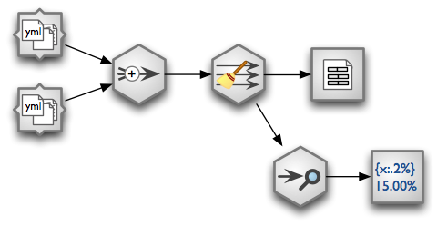
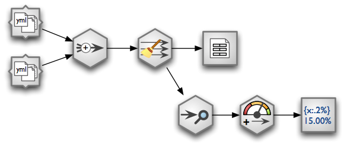

Stream: Append Sources, Clean, Store and Audit
==============================================

**Situation**: We have two directories containing YAML files with donations of same structure (or
at least same subset of fields that we are interested in)::

    donations/source1/
        record_0.yml
        record_1.yml
        record_2.yml
        ...
    donations/source2/
        record_0.yml
        record_1.yml
        record_2.yml
        ...

Some numeric fields are represented as strings, contain leading or trailing spaces, spaces between
numbers.
        
**Objective**: We want to create a CSV file ``donations.csv`` that will contain records from both
directories. Moreover we want to clean the fields: strip spaces from strings and convert mumbers
stored as strings into numbers. Also we want to know, how many of fields are filled in.

Solution
--------

Problem can be solved using following data stream:

    Data stream.
    
The stream consists of following nodes (from left to right):

* two YAML directory sources (:ref:`YamlDirectorySourceNode`)
* :ref:`AppendNode` - sequentially concatenate streams
* :ref:`CoalesceValueToTypeNode` - fix field values according to specified type, for example
  convert strings into integers for fields of type `integer`
* :ref:`CSVTargetNode`
* :ref:`AuditNode`
* :ref:`FormattedPrinterNode`

Code
----

Import brewery streams and nodes:

.. code-block:: python

    from brewery.streams import *
    from brewery.nodes import *

Create a dictionary containing nodes. We will refer to the nodes by name later.

.. code-block:: python

    nodes = {
        "source1": YamlDirectorySourceNode(path = "donations/source1"),
        "source2": YamlDirectorySourceNode(path = "donations/source2"),
        "append": AppendNode(),
        "clean": CoalesceValueToTypeNode(),
        "output": CSVTargetNode(resource = "donations.csv"),
        "audit": AuditNode(distinct_threshold = None),
        "print": FormattedPrinterNode()
    }

Connect the nodes:

.. code-block:: python

    connections = [ ("source1", "append"),
                    ("source2", "append"),
                    ("append", "clean"),
                    ("clean", "output"),
                    ("clean", "audit"),
                    ("audit", "print")
                    ]

Specify fields that we are going to process from sources. Also specify their types for automated
cleansing. For more information about fields see :class:`brewery.ds.Field` and
:class:`brewery.ds.FieldList`. If you are not creating `FieldList` object directly, then make sure
that you convert an array using :func:`brewery.ds.fieldlist`.

.. code-block:: python

    fields = [  "file",
                ("source_code", "string"),
                ("id", "string"),
                ("receiver_name", "string"),
                ("project", "string"),
                ("requested_amount", "float"),
                ("received_amount", "float"),
                ("source_comment", "string")
            ]

    nodes["source1"].fields = ds.fieldlist(fields)
    nodes["source2"].fields = ds.fieldlist(fields)

Configure printer node (:ref:`FormattedPrinterNode`) to create nicely aligned text output:

.. code-block:: python

    nodes["print"].header = u"field                            nulls      empty   distinct\n" \
                             "------------------------------------------------------------"
    nodes["print"].format = u"{field_name:<30.30} {null_record_ratio: >7.2%} "\
                             "{empty_string_count:>10} {distinct_count:>10}"

Create :class:`brewery.streams.Stream` and run it:

.. code-block:: python

    stream = Stream(nodes, connections)
    stream.run()

Stream will create the ``donations.csv`` and will produce a report on standard output that will
look something like this::

    field                            nulls      empty   distinct
    ------------------------------------------------------------
    file                             0.00%          0         32
    source_code                      0.00%          0          2
    id                               9.96%          0        907
    receiver_name                    9.10%          0       1950
    project                          0.05%          0       3628
    requested_amount                22.90%          0        924
    received_amount                  4.98%          0        728
    source_comment                  99.98%          0          2

Improvement
-----------

We know how complete (non-null) our fields are. However, are they complete enough? Say we want at
least 95% completeness. We can learn from our report which fields are complete enough or not,
based on the ``nulls`` report coulmn. We still have to read the number and decide.

To aid our decision, in addition to percentage of nulls we add a flag whether the field is ok or
not based on threshold. If the field null percent is greater than 5% the field quality fails and
we mark it as ``fail``, otherwise the field test passes and we mark it as ``ok``. To derive the
flag we insert a :ref:`ValueThresholdNode` node.

    Updated data stream with value threshold node.

.. code-block:: python

    nodes = {
        "source1": YamlDirectorySourceNode(path = "donations/source1"),
        "source2": YamlDirectorySourceNode(path = "donations/source2"),
        "append": AppendNode(),
        "clean": CoalesceValueToTypeNode(),
        "output": CSVTargetNode(resource = "donations.csv"),
        "audit": AuditNode(distinct_threshold = None),
        "threshold": ValueThresholdNode(), # <-- this was is added
        "print": FormattedPrinterNode()
    }

Rewire nodes:

.. code-block:: python

    connections = [ ("source1", "append"),
                    ("source2", "append"),
                    ("append", "clean"),
                    ("clean", "output"),
                    ("clean", "audit"),     # \
                    ("audit", "threshold"), #  |-- rewired
                    ("threshold", "print")  # /
                    ]

We consider field to be `ok` when null count is less than 5%, otherwise test fails. Therefore we
configure threshold node like this:

.. code-block:: python

    nodes["threshold"].thresholds = [ ["null_record_ratio", 0.05] ]
    nodes["threshold"].bin_names = ("ok", "fail")

Update report template to include new derived field:

.. code-block:: python

    nodes["print"].header = u"field                            nulls     status   distinct\n" \
                             "------------------------------------------------------------"
    nodes["print"].format = u"{field_name:<30.30} {null_record_ratio: >7.2%} "\
                             "{null_record_ratio_bin:>10} {distinct_count:>10}"

The output should look like this::

    field                            nulls     status   distinct
    ------------------------------------------------------------
    file                             0.00%         ok         32
    source_code                      0.00%         ok          2
    id                               9.96%       fail        907
    receiver_name                    9.10%       fail       1950
    project                          0.05%         ok       3628
    requested_amount                22.90%       fail        924
    received_amount                  4.98%         ok        728
    source_comment                  99.98%       fail          2

.. seealso::

    * :ref:`YamlDirectorySourceNode`
    * :ref:`AppendNode`
    * :ref:`CoalesceValueToTypeNode`
    * :ref:`CSVTargetNode`
    * :ref:`AuditNode`
    * :ref:`FormattedPrinterNode`
    * :ref:`ValueThresholdNode`
