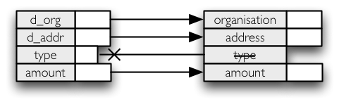

:mod:`metadata` --- Information about data structure
====================================================

.. module:: metadata
   :synopsis: data structure, field type details.

While working with structured data it is helpful to know how the structure looks like, what are the
fields, what are their types.

Field types
-----------

There are two kinds of field types: storage type and analytical type. The storage type specifies how the
value is being stored in the source, the type is normalized. Another type is analytical type which is
used in data mining, defines if the field can be used by particular algorithm and how the field is
treated by mining algorithms.

**Storage types**

.. list-table::
	:header-rows: 1
	:widths: 15 80

	* - Storage Type
	  - Description
	* - `string` 
	  - names, labels, short descriptions; mostly implemeted as ``VARCHAR`` type in 
	    database, or can be found as CSV file fields
	* - `text` 
	  - longer texts, long descriptions, articles
	* - `integer` 
	  - discrete values
	* - `float`
	  - numerical value with floating point
	* - `boolean` 
	  - binary value, mostly implemented as small integer
	* - `date`
	  - calendar date representation

**Analytical types**

.. list-table::
	:header-rows: 1
	:widths: 15 80

	* - Analytical Type
	  - Description
	* - `set`
	  - Values represent categories, like colors or contract. types. Fields of this type might be numbers
	    which represent for example group numbers, but have no mathematical interpretation. For example
	    addition of group numbers 1+2 has no meaning.
	* - `ordered_set`
	  - Similar to `set` field type, but values can be ordered in a meaningful order.
	* - `discrete`
	  - Set of integers - values can be ordered and one can perform arithmetic operations on them, such as:
	    1 contract + 2 contracts = 3 contracts
	* - `flag`
	  - Special case of `set` type where values can be one of two types, such as 1 or 0, 'yes' or 'no', 'true' or 'false'.
	* - `range`
	  - Numerical value, such as financial amount, temperature
	* - `default`
	  - Analytical type is not explicitly set and default type for fields storage type is used. Refer to the
	    table of default types.
	* - `typeless`
	  - Field has no analytical relevance.

Default analytical types:
    * `integer` is `discrete`
    * `float` is `range`
    * `unknown`, `string`, `text`, `date` are typeless

Fields and Field Lists
----------------------

Main metadata class is ``Field`` which gives information about name, types and other useful data
attributes. Field might represent a database column in a SQL database, a key in a dictionary-like
record...

.. autoclass:: brewery.metadata.Field

In most cases we are dealing with structured data here, therefore we are working with multiple fields
and values at once. For that purpose there is ``FieldList`` – ordered list of field descriptions:

Fields can be compared using ``==`` and ``!=`` operators. They are equal if all attributes are equal.
Getting a string representation ``str(field)`` of a field returns field name.

.. code-block:: python

	name

.. autoclass:: brewery.metadata.FieldList

In addition, the FieldList behaves as a list: implements ``len()``, ``del``, ``[]`` with field index,
``+=`` for appending fields, ``+`` for creating new field list by concatenating two other lists.

Field lists are used in data sources, data targets, processing streams, nodes, ... They are mostly
present in the form of a ``fields`` attribute (in a class) or function parameter with the same name. To
make it easy to quickly construct list of fields with all necessary metadata you can do:

.. code-block:: python

	import brewery.metadata as metadata

	fields = metadata.FieldList(["organisation", "address", "type", "amount"])

If you are implementing a function that changes data structure, do not change the fields you have
received from the source. Make a copy and do modifications in the copy:

.. code-block:: python
	
	import brewery.streams

	class AppendTimestampNode(streams.Node):
		def initialize(self):
			# Create a copy
			fields = self.input.fields.copy()
			
			# Append custom field(s)
			timestamp_field = Field("timestamp", storage_type = "date")
			fields.append(timestamp_field)
			
			self.output_fields = fields

Concrete storage type
---------------------

Each field can have specified `concrete storage type` - closest type definition to the real storage.
Value of this attribute is dependent on a backend providing field information about data source or data
target. For example, SQL backend can use type class or type class instance. Reason for storing concrete
storage type is to preserve the type in homogenous environment in the first place. Second reason is to
allow custom mappings between backend data types.

Brewery does not perform any mapping currently. If the backends are not compatible, the concrete
storage is simply ignored and default type from normalized plain ``storage_type`` is used.

Field mapping
-------------

Quite common operation is field renaming and dropping of unused fields, for example those that were
already transformed. This might be also called field filtering.

.. autoclass:: brewery.metadata.FieldMap

For example our requirement is to do following field mapping/filtering:

.. code-block:: python

	import brewery.metadata as metadata
	
	fields = metadata.FieldList(["d_org", "d_addr", "type", "amount"])

	map = metadata.FieldMap(rename = {"d_org": "organisation", "d_addr":"address"}, drop = ["type"])
	mapped_fields = map.map(fields)
	print(mapped_fields.names())
	
	# Now we have mapped_fields = ['organisation', 'address', 'amount']
	
To apply field mapping onto a row (list, tuple), there is ``RowFieldFilter``. Following example shows
how to filter fields from list of rows:

.. code-block:: python

	# Assume that we have rows with structure specified in previous example in ``fields``

	filter = map.row_filter(fields)
	
	output = []
	for row in rows:
		output.append(filter.filter(row))
		
	# Output will contain only fields as in ``mapped_fields`` from the previous example
	
.. autoclass:: brewery.metadata.RowFieldFilter
