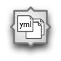
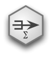
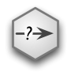
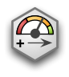

Data Source
===========

CSV Source
----------

.. image:: nodes/csv_file_source_node.png
   :align: right

*Read data from a comma separated values (CSV) file.*

Source node that reads comma separated file from a filesystem or a remote URL.

It is recommended to configure node fields before running. If you do not do so, fields are
read from the file header if specified by `read_header` flag. Field storage types are set to
`string` and analytical type is set to `typeless`.

.. list-table:: Attributes
   :header-rows: 1
   :widths: 40 80

   * - attribute
     - description
   * - resource
     - File name or URL containing comma separated values
   * - fields
     - fields contained in the file
   * - read_header
     - flag determining whether first line contains header or not
   * - skip_rows
     - number of rows to be skipped
   * - encoding
     - resource data encoding, by default no conversion is performed
   * - delimiter
     - record delimiter character, default is comma ','
   * - quotechar
     - character used for quoting string values, default is double quote

Record List Source
------------------

.. image:: nodes/record_list_source_node.png
   :align: right

*Provide list of dict objects as data source.*

Source node that feeds records (dictionary objects) from a list (or any other iterable)
object.

.. list-table:: Attributes
   :header-rows: 1
   :widths: 40 80

   * - attribute
     - description
   * - list
     - List of records represented as dictionaries.
   * - fields
     - Fields in the list.

Row List Source
---------------

.. image:: nodes/row_list_source_node.png
   :align: right

*Provide list of lists or tuples as data source.*

Source node that feeds rows (list/tuple of values) from a list (or any other iterable)
object.

.. list-table:: Attributes
   :header-rows: 1
   :widths: 40 80

   * - attribute
     - description
   * - list
     - List of rows represented as lists or tuples.
   * - fields
     - Fields in the list.

Data Stream Source
------------------

.. image:: nodes/row_list_source_node.png
   :align: right

*Generic data stream data source node.*

Generic data stream source. Wraps a :mod:`brewery.ds` data source and feeds data to the 
output.

The source data stream should configure fields on initialize().

Note that this node is only for programatically created processing streams. Not useable
in visual, web or other stream modelling tools.

.. list-table:: Attributes
   :header-rows: 1
   :widths: 40 80

   * - attribute
     - description
   * - stream
     - Data stream object.

YAML Directory Source
---------------------

*Read data from a directory containing YAML files*

Source node that reads data from a directory containing YAML files.

The data source reads files from a directory and treats each file as single record. For example,
following directory will contain 3 records::

    data/
        contract_0.yml
        contract_1.yml
        contract_2.yml

Optionally one can specify a field where file name will be stored.

.. list-table:: Attributes
   :header-rows: 1
   :widths: 40 80

   * - attribute
     - description
   * - path
     - Path to a directory
   * - extension
     - file extension to look for, default is yml. If none is given, then all regular files in the directory are read.
   * - filename_field
     - name of a new field that will contain file name

Record Operations
=================

Aggregate Node
--------------

*Aggregate values grouping by key fields.*

Aggregate

.. list-table:: Attributes
   :header-rows: 1
   :widths: 40 80

   * - attribute
     - description
   * - keys
     - List of fields according to which records are grouped
   * - record_count_field
     - Name of a field where record count will be stored. Default is `record_count`

Append
------

.. image:: nodes/append_node.png
   :align: right

*Concatenate input streams.*

Sequentialy append input streams. Concatenation order reflects input stream order. The
input streams should have same set of fields.

Data Audit
----------

.. image:: nodes/data_audit_node.png
   :align: right

*Perform basic data audit.*

Node chcecks stream for empty strings, not filled values, number distinct values.

Audit note passes following fields to the output:

    * `field_name` - name of a field from input
    * `record_count` - number of records
    * `null_count` - number of records with null value for the field
    * `null_record_ratio` - ratio of null count to number of records
    * `empty_string_count` - number of strings that are empty (for fields of type string)
    * `distinct_count` - number of distinct values (if less than distinct threshold). Set
      to None if there are more distinct values than `distinct_threshold`.

.. list-table:: Attributes
   :header-rows: 1
   :widths: 40 80

   * - attribute
     - description
   * - distinct_threshold
     - number of distinct values to be tested. If there are more than the threshold, then values are not included any more and result `distinct_values` is set to None 

Distinct Node
-------------

.. image:: nodes/distinct_node.png
   :align: right

*Pass only distinct records (discard duplicates) or pass only duplicates*

Node will pass distinct records with given distinct fields.

If `discard` is ``False`` then first record with distinct keys is passed to the output. This is
used to find all distinct key values.

If `discard` is ``True`` then first record with distinct keys is discarded and all duplicate
records with same key values are passed to the output. This mode is used to find duplicate
records. For example: there should be only one invoice per organisation per month. Set
`distinct_fields` to `organisaion` and `month`, sed `discard` to ``True``. Running this node
should give no records on output if there are no duplicates.

.. list-table:: Attributes
   :header-rows: 1
   :widths: 40 80

   * - attribute
     - description
   * - distinct_fields
     - List of key fields that will be considered when comparing records
   * - discard
     - Field where substition result will be stored. If not set, then original field will be replaced with new value.

Merge Node
----------

.. image:: nodes/merge_node.png
   :align: right

*no description*

Merge two or more streams (join)

Sample Node
-----------

*Pass data sample from input to output.*

Create a data sample from input stream. There are more sampling possibilities:

* fixed number of records
* % of records, random *(not yet implemented)*
* get each n-th record *(not yet implemented)*

Node can work in two modes: pass sample to the output or discard sample and pass the rest.
The mode is controlled through the `discard` flag. When it is false, then sample is passed
and rest is discarded. When it is true, then sample is discarded and rest is passed.

.. list-table:: Attributes
   :header-rows: 1
   :widths: 40 80

   * - attribute
     - description
   * - sample_size
     - Size of the sample to be passed to the output
   * - discard
     - flag whether the sample is discarded or included

Select
------

*Select records by a predicate function.*

Select records that will be selected by a predicate function.

Example: configure a node that will select records where `amount` field is greater than 100

.. code-block:: python

    def select_greater_than(value, threshold):
        return value > threshold

    node.function = select_greater_than
    node.fields = ["amount"]
    node.kwargs = {"threshold": 100}

The `discard` flag controls behaviour of the node: if set to ``True``, then selection is
inversed and fields that function evaluates as ``True`` are discarded. Default is False -
selected records are passed to the output.

.. list-table:: Attributes
   :header-rows: 1
   :widths: 40 80

   * - attribute
     - description
   * - function
     - Predicate function. Should be a callable object.
   * - fields
     - List of field names to be passed to the function.
   * - discard
     - flag whether the selection is discarded or included
   * - kwargs
     - Keyword arguments passed to the predicate function

Set Select
----------

.. image:: nodes/set_select_node.png
   :align: right

*Select records by a predicate function.*

Select records where field value is from predefined set of values.

Use case examples:

* records from certain regions in `region` field
* recprds where `quality` status field is `low` or `medium`

.. list-table:: Attributes
   :header-rows: 1
   :widths: 40 80

   * - attribute
     - description
   * - field
     - Field to be tested.
   * - value_set
     - set of values that will be used for record selection
   * - discard
     - flag whether the selection is discarded or included

Field Operations
================

Binning
-------

.. image:: nodes/histogram_node.png
   :align: right

*Derive a field based on binned values (histogram)*

Derive a bin/category field from a value.

*Note: this node is not yet implemented*

Binning modes:

* fixed width (for example: by 100)
* fixed number of fixed-width bins
* n-tiles by count or by sum
* record rank

    

Field Map
---------

.. image:: nodes/field_map_node.png
   :align: right

*Rename or drop fields from the stream.*

Node renames input fields or drops them from the stream.
    

.. list-table:: Attributes
   :header-rows: 1
   :widths: 40 80

   * - attribute
     - description
   * - map_fields
     - Dictionary of input to output field name.
   * - drop_fields
     - List of fields to be dropped from the stream.

String Strip
------------

*Strip characters.*

Strip spaces (orother specified characters) from string fields.

.. list-table:: Attributes
   :header-rows: 1
   :widths: 40 80

   * - attribute
     - description
   * - fields
     - List of string fields to be stripped. If none specified, then all fields of type string are stripped
   * - chars
     - Characters to be stripped. By default all white-space characters are stripped.

Text Substitute
---------------

.. image:: nodes/text_substitute_node.png
   :align: right

*Substitute text in a field using regular expression.*

Substitute text in a field using regular expression.

.. list-table:: Attributes
   :header-rows: 1
   :widths: 40 80

   * - attribute
     - description
   * - field
     - Field containing a string or text value where substition will be applied
   * - derived_field
     - Field where substition result will be stored. If not set, then original field will be replaced with new value.
   * - substitutions
     - List of substitutions: each substition is a two-element tuple (`pattern`, `replacement`) where `pattern` is a regular expression that will be replaced using `replacement`

Value Threshold
---------------

*Bin values based on a threshold.*

Create a field that will refer to a value bin based on threshold(s). Values of `range` type
can be compared against one or two thresholds to get low/high or low/medium/high value bins.

*Note: this node is not yet implemented*

The result is stored in a separate field that will be constructed from source field name and
prefix/suffix.

For example:
    * amount < 100 is low
    * 100 <= amount <= 1000 is medium
    * amount > 1000 is high

Generated field will be `amount_threshold` and will contain one of three possible values:
`low`, `medium`, `hight`

Another possible use case might be for binning after data audit: we want to measure null 
record count and we set thresholds:
    
    * ratio < 5% is ok
    * 5% <= ratio <= 15% is fair
    * ratio > 15% is bad
    
We set thresholds as ``(0.05, 0.15)`` and values to ``("ok", "fair", "bad")``
    

.. list-table:: Attributes
   :header-rows: 1
   :widths: 40 80

   * - attribute
     - description
   * - field_thresholds
     - Dictionary of range type field names and threshold tuples.
   * - bins
     - Names of bins based on threshold. Default is low, medium, high
   * - prefix
     - field prefix to be used
   * - suffix
     - field suffix to be used

Data Target
===========

Formatted Printer
-----------------

.. image:: nodes/formatted_printer_node.png
   :align: right

*Print input using a string formatter to an output IO stream*

Target node that will print output based on format.

Refer to the python formatting guide:

    http://docs.python.org/library/string.html

Example:

Consider we have a data with information about donations. We want to pretty print two fields:
`project` and `requested_amount` in the form::

    Hlavicka - makovicka                                            27550.0
    Obecna kniznica - symbol moderneho vzdelavania                 132000.0
    Vzdelavanie na europskej urovni                                 60000.0

Node for given format is created by:

.. code-block:: python

    node = FormattedPrinterNode(format = u"{project:<50.50} {requested_amount:>20}")

.. list-table:: Attributes
   :header-rows: 1
   :widths: 40 80

   * - attribute
     - description
   * - format
     - Format string to be used
   * - output
     - IO object. If not set then sys.stdout will be used. If it is a string, then it is considered a filename.
   * - delimiter
     - Record delimiter. By default it is new line character.
   * - header
     - Header string - will be printed before printing first record
   * - footer
     - Footer string - will be printed after all records are printed

Record List Target
------------------

*Store data as list of dictionaries (records)*

Target node that stores data from input in a list of records (dictionary objects)
object.

To get list of fields, ask for `output_fields`.

.. list-table:: Attributes
   :header-rows: 1
   :widths: 40 80

   * - attribute
     - description
   * - records
     - Created list of records represented as dictionaries.

Row List Target
---------------

*Store data as list of tuples*

Target node that stores data from input in a list of rows (as tuples).

To get list of fields, ask for `output_fields`.

.. list-table:: Attributes
   :header-rows: 1
   :widths: 40 80

   * - attribute
     - description
   * - rows
     - Created list of tuples.

Data Stream Target
------------------

*Generic data stream data target node.*

Generic data stream target. Wraps a :mod:`brewery.ds` data target and feeds data from the 
input to the target stream.

The data target should match stream fields.

Note that this node is only for programatically created processing streams. Not useable
in visual, web or other stream modelling tools.

.. list-table:: Attributes
   :header-rows: 1
   :widths: 40 80

   * - attribute
     - description
   * - stream
     - Data target object.

