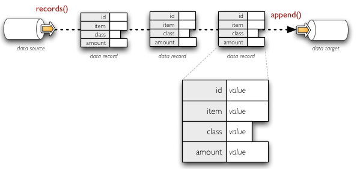
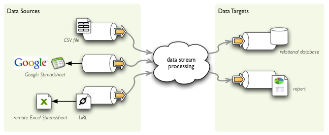

#######################
Data Objects and Stores
#######################

Overview
========

Data objects serve as wrappers or interfaces to structured datasets with
various representations. They might be used as data sources (providers) or as
data targets (consumers) or as both.

Once initialized and condigured, a data object has a well known structure
represented by a :class:`FieldList`.

If an object serves as source, it provides at least following functionality:

* `rows()` - iterator of object's rows in form of unlabeled tuples or lists
* `representations()` - list of object's representation names, such as `rows`,
  `sql_statement` or `sql_table`.

Example data sources might be: a CSV file, database table, Google Spreadsheet
document.

Target objects should provide at least:

* `append(row)` - appends a row to the dataset
* `append_from(object)` – appends all rows from `object`. This operation might
  reject all objects with incompatible representations.
* `truncate()` – if target object is a stored dataset, not a stream, then the
  contents of the dataset is trucated (`DELETE` all in SQL, for example)
* `flush()` – target object might cache appended records, this assures that
  the records are writen to the actual representation of the target

Representations
---------------

Object might have multiple representations. During data processing, the most
suitable representation for a given operation is used.

Rows
~~~~

.. figure:: rows_streaming.png

    Example of streaming data as sequence of records - dictionaries with
    key-value pairs.

Records
~~~~~~~

    Example of streaming data as sequence of rows - tuples of values.

Stores
======

Object store represents a collection of data objects, for example a relational
database is an object store for table data objects.

.. autoclass:: brewery.objects.base.DataStore

.. autoclass:: brewery.objects.base.SimpleMemoryStore

.. autoclass:: brewery.objects.sql.SQLDataStore
   
.. todo::

   This part of docs has to be updated.

.. warning::

   Following documentation is obsolete

Old documentation
=================

    Example of streaming data between data stores.

Data Sources
------------

==============  ==========================================  ============================
Data source     Description                                 Dataset reference
==============  ==========================================  ============================
csv             Comma separated values (CSV) file/URI       file path, file-like object,
                resource                                    URL
                
xls             MS Excel spreadsheet                        file path, URL
gdoc            Google Spreadsheet                          spreadsheet key or name
sql             Relational database table                   connection + table name
mongodb         MongoDB database collection                 connection + table name
yamldir         Directory containing yaml files             directory
                - one file per record
elasticsearch   Elastic Search – Open Source, Distributed,
                RESTful, Search Engine
==============  ==========================================  ============================

Data sources should implement:

* initialize() - delayed initialisation: get fields if they are not set, open file stream, ...
* rows() - returns iterable with value tuples
* records() - returns iterable with dictionaries of key-value pairs

Should provide property ``fields``, optionally might provide assignment of this property.

Data Targets
------------

==================== ======================================================
Data target          Description
==================== ======================================================
csv                  Comma separated values (CSV) file/URI resource
sql                  Relational database table
mongodb              MongoDB database collection
yamldir              Directory containing yaml files - one file per record
jsondir              Directory containing json files - one file per record
                     (not yet)
html                 HTML file or a string target
elasticsearch        Elastic Search – Open Source, Distributed,
                     RESTful, Search Engine
==================== ======================================================

Data targets should implement:

* initialize() - create dataset if required, open file stream, open db connection, ...
* append(object) - appends object as row or record depending whether it is a dictionary or a list

Base Classes
------------

Use these classes as super classes for your custom structured data sources or data targets.

.. autoclass:: brewery.ds.DataStream

.. autoclass:: brewery.ds.DataSource

.. autoclass:: brewery.ds.DataTarget

Sources
-------

.. autoclass:: brewery.ds.CSVDataSource

.. autoclass:: brewery.ds.GoogleSpreadsheetDataSource

.. autoclass:: brewery.ds.XLSDataSource

.. autoclass:: brewery.ds.SQLDataSource

.. autoclass:: brewery.ds.MongoDBDataSource

.. autoclass:: brewery.ds.YamlDirectoryDataSource

Targets
-------

.. autoclass:: brewery.ds.CSVDataTarget

.. autoclass:: brewery.ds.SQLDataTarget

.. autoclass:: brewery.ds.MongoDBDataTarget

.. autoclass:: brewery.ds.YamlDirectoryDataTarget

.. autoclass:: brewery.ds.StreamAuditor

.. autoclass:: brewery.ds.SimpleHTMLDataTarget
