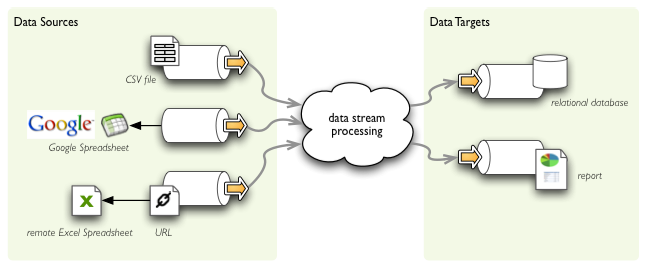
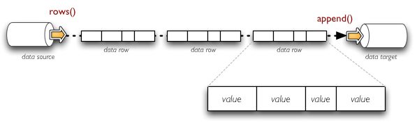

:mod:`ds` --- Data Stores
==========================

.. module:: ds
   :synopsis: data sources and data targets

.. warning::

	This module will be very likely renamed from `ds` to 'stores'. Currently there is confusion 
	whether 'ds' means 'data stores' or 'data streams'. There is also another module called `streams`:  
	processing streams based on nodes connected with pipes.

Overview
--------

Data stores provide interface for common way of reading from and writing to various structured data
stores through structured data streams. It allows you to read CSV file and merge it with Excel
spreadsheet or Google spreadsheet, then perform cleansing and write it to a relational database table
or create a report.

    Example of streaming data between data stores.

The data streams can be compared to file-like stream objects where structured data is being passed
instead of bytes. There are two ways how to look at structured data: as a set of lists of values or as
a set of key-value pairs (set of dictionaries). Some sources provide one or the other way of looking at
the data, some processing is better with the list form, another might be better with the dictionary
form. Brewery allows you to use the form which is most suitable for you.

.. figure:: records_streaming.png

    Example of streaming data as sequence of rows - tuples of values.

    Example of streaming data as sequence of records - dictionaries with key-value pairs.

At any time you are able to retrieve stream metadata: list of fields being streamed. For more
information see :mod:`metadata` where you can find more information.

Data Sources
------------

============== ========================================== ============================
Data source    Description                                Dataset reference
============== ========================================== ============================
csv            Comma separated values (CSV) file/URI      file path, file-like object,
               resource                                   URL
              
xls            MS Excel spreadsheet                       file path, URL
gdoc           Google Spreadsheet                         spreadsheet key or name
sql            Relational database table                  connection + table name
mongodb        MongoDB database collection                connection + table name
yamldir        Directory containing yaml files            directory
               - one file per record
elasticsearch  Elastic Search – Open Source, Distributed,
               RESTful, Search Engine
============== ========================================== ============================

Data sources should implement:

* initialize() - delayed initialisation: get fields if they are not set, open file stream, ...
* rows() - returns iterable with value tuples
* records() - returns iterable with dictionaries of key-value pairs

Should provide property ``fields``, optionally might provide assignment of this property.

Data Targets
------------

==================== ======================================================
Data target          Description
==================== ======================================================
csv                  Comma separated values (CSV) file/URI resource
sql                  Relational database table
mongodb              MongoDB database collection
yamldir              Directory containing yaml files - one file per record
jsondir              Directory containing json files - one file per record
                     (not yet)
html                 HTML file or a string target
elasticsearch        Elastic Search – Open Source, Distributed,
                     RESTful, Search Engine
==================== ======================================================

Data targets should implement:

* initialize() - create dataset if required, open file stream, open db connection, ...
* append(object) - appends object as row or record depending whether it is a dictionary or a list

Base Classes
------------

Use these classes as super classes for your custom structured data sources or data targets.

.. autoclass:: brewery.ds.DataStream

.. autoclass:: brewery.ds.DataSource

.. autoclass:: brewery.ds.DataTarget

Sources
-------

.. autoclass:: brewery.ds.CSVDataSource

.. autoclass:: brewery.ds.GoogleSpreadsheetDataSource

.. autoclass:: brewery.ds.XLSDataSource

.. autoclass:: brewery.ds.SQLDataSource

.. autoclass:: brewery.ds.MongoDBDataSource

.. autoclass:: brewery.ds.YamlDirectoryDataSource

Targets
-------

.. autoclass:: brewery.ds.CSVDataTarget

.. autoclass:: brewery.ds.SQLDataTarget

.. autoclass:: brewery.ds.MongoDBDataTarget

.. autoclass:: brewery.ds.YamlDirectoryDataTarget

.. autoclass:: brewery.ds.StreamAuditor

.. autoclass:: brewery.ds.SimpleHTMLDataTarget
