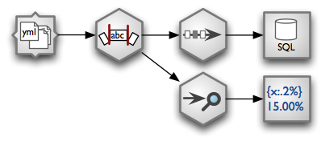
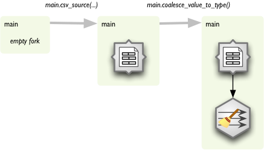

:mod:`streams` --- Data Analysis and Processing Streams
====================================================

.. module:: streams
   :synopsis: data analysis and processing streams

The data processing stream is a network of data processing nodes connected by data
pipes. There are several data processing node types:

* *source nodes* - provide data from data sources such as CSV files or
  database tables
* *target nodes* - nodes for consuming data and storing them or creating data
  visualizations
* *record nodes* - perform operations on whole records, such as merging,
  joining, aggregations
* *field nodes* - perform operations on particular fields, such as text
  substitution, field renaming, deriving new fields, restructuring

Data Processing Streams
-----------------------

    Example of a processing stream:

    * load YAML fields from a directory - each file represents one record
    * Strip all string fields.
    * Remove duplicates and store unique records in a SQL database table
    * Perform a data audit and pretty-print output using a formatted text printer

Constructing a stream the "object way":

.. code-block:: python

    from brewery.nodes import *
    from brewery.streams import *
    import brewery.metadata as metadata

    # Prepare nodes

    nodes = {
        "source": YamlDirectorySourceNode(path = "data/donations"),
        "strip": StringStripNode(),
        "distinct": DistinctNode(keys = ["year", "receiver", "project"]),
        "target": SQLTableTarget(url = "postgres://localhost/data", table = "donations"),
        "audit": AuditNode(),
        "print": FormattedPrinterNode(output = "audit.txt")
    }

    # Configure nodes

    nodes["source"].fields = metadata.FieldList([
                                            ("year", "integer"),
                                            ("receiver", "string"),
                                            ("project", "string"),
                                            ("requested_amount", "float"),
                                            ("received_amount", "float"),
                                            ("source_comment", "string")])

    nodes["print"].header = u"field                          nulls      empty\n" \
                             "-----------------------------------------------"
    nodes["print"].format = u"{field_name:<30.30} {null_record_ratio:3.2%} {empty_string_count:>10}"

    connections = [ ("source", "strip"),
                    ("strip", "distinct"),
                    ("distinct", "target"),
                    ("strip", "audit"),
                    ("audit", "print")
                    ]

    # Create and run stream

    stream = Stream(nodes, connections)
    stream.run()

The created audit.txt file will contain::

    field                          nulls      empty
    -----------------------------------------------
    year                           0.00%          0
    receiver                       0.00%          5
    project                        0.51%          0
    requested_amount               0.70%          0
    received_amount                6.40%          0
    source_comment                99.97%          0

The core class is ``Stream``:

.. autoclass:: brewery.streams.Stream

The stream is constructed using nodes. For more information about nodes see :doc:`/node_reference`.

Running Streams
---------------

Streams are being run using ``Stream.run()``. The stream nodes are executed in parallel - each node
is run in separate thread.

Stream raises ``StreamError`` if there are issues with the network before or during initialization and
finalization phases. When the stream is run and something happens, then ``StreamRuntimeError`` is
raised which contains more detailed information:

.. autoclass:: brewery.streams.StreamRuntimeError

Preferred way of running the stream in manually written scripts is:

.. code-block:: python

    try:
        stream.run()
    except brewery.streams.StreamRuntimeError as e:
        e.print_exception()

Forking Forks with Higher Order Messaging
-----------------------------------------

There is another way of constructing streams which uses “higher order messaging”. It means, that
instead of constructing the stream from nodes and connections, you pretend to “call” functions that
process your data. In fact the function call is interpreted as step in processing stream construction.

.. code-block:: python

    trunk.csv_source("data.csv")
    trunk.sample(1000)
    trunk.aggregate(keys = ["year"])
    trunk.formatted_printer(...)

Executing the functions as written might be very expensive in terms of time and memory. What is
in fact happening is that instead of executing the data processing functions a stream network is being
constructed and the construction is being done by using forked branches. To start, an empty stream
and first fork has to be created:

.. code-block:: python

    from brewery.streams import *

    stream = Stream()
    main = stream.fork()
    ...

Now we have fork ``main``. Each function call on ``main`` will append a new processing node to the fork and the new
node will be connected to the previous node of the fork.

Function names are based on node names in most of the cases. There might be custom function names for
some nodes in the future, but now there is just simple rule:

#. de-camelize node name: CSVSourceNode to csv source node
#. replace spaces with underscores: csv_source_node
#. remove ‘node’ suffix: csv_source

Arguments to the function are the same as arguments for node constructor. If you want to do more node
configuration you can access current node with node attribute of the fork:

.. code-block:: python

    main.node.keys = ["country"]

Run the stream as if it was constructed manually from nodes and connections:

.. code-block:: python

    stream.run()

There are plenty of situations where linear processing is not sufficient and we will need to have
branches. To create another branch, we fork() a fork. For example, to attach a data audit to the stream
insert following code right after the node we want to audit:

.. code-block:: python

    # we are in main at node after which we want to have multiple branches

    audit = trunk.fork()
    audit.audit()
    audit.value_threshold(...)
    audit.formatted_printer(...)

    # continue main.* branch here...

Example
^^^^^^^

.. code-block:: python

    from brewery.streams import Stream
    from brewery.metadata import FieldList

    stream = Stream()

    a_list = [
        {"i": 1, "name": "apple"},
        {"i": 2, "name": "bananna"},
        {"i": 3, "name": "orange"}
    ]

    fields = FieldList(["i", "name"])

    trunk = stream.fork()
    trunk.record_list_source(a_list = a_list, fields = fields)
    trunk.derive("i*100 + len(name)")
    csv_branch = trunk.fork()
    trunk.record_list_target()
    record_target = trunk.node
    csv_branch.csv_target("test_stream.csv")

    stream.run()

    for record in record_target.records:
        print record

Output will be::

    {'i': 1, 'name': 'apple', 'new_field': 105}
    {'i': 2, 'name': 'banana', 'new_field': 207}
    {'i': 3, 'name': 'orange', 'new_field': 306}

The newly created `test_stream.csv` file will contain::

    i,name,new_field
    1,apple,105
    2,banana,207
    3,orange,306

Custom nodes
------------

To implement custom node, one has to subclass the ``Node`` class:

.. autoclass:: brewery.streams.Node

Node uses pipes for communication. ``SimplePipe`` is abstract class that should be used as base class
for any Pipe implementation:

.. autoclass:: brewery.streams.SimplePipe

The ``Pipe`` class uses Python threading for node thread concurrency:

.. autoclass:: brewery.streams.Pipe

