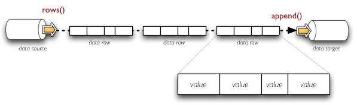

Data Streams
++++++++++++

Overview
--------

Data streams provide interface for common way of reading from and writing to various structured data
sources. With streams you can easily read CSV file and merge it with Excel spreadsheet or Google
spreadsheet, then perform cleansing and write it to a relational database table or create a report.

.. figure:: data_streams_overview.png

    Example of data streams.

The streams can be compared to file-like stream objects where structured data is being passed instead of
bytes. There are two ways how to look at structured data: as a set of lists of values or as a set of
key-value pairs (set of dictionaries). Some sources provide one or the other way of looking at the data,
some processing is better with the list form, another might be better with the dictionary form. Brewery
allows you to use the form which is most suitable for you.

.. figure:: records_streaming.png

    Example of streaming data as sequence of rows - tuples of values.

    Example of streaming data as sequence of records - dictionaries with key-value pairs.

Metadata
--------

At any time you are able to retrieve stream metadata: list of fields being streamed. For more information
see documentation for :class:`brewery.ds.Field` where you can find list of field attributes, data storage types,
analytical types and more.

Data Sources
============

============= ========================================== ============================
Data source   Description                                Dataset reference
============= ========================================== ============================
csv           Comma separated values (CSV) file/URI      file path, file-like object,
              resource                                   URL
              
xls           MS Excel spreadsheet                       file path, URL
gdoc          Google Spreadsheet                         spreadsheet key or name
rdb           Relational database table (using DB API 2  connection + table name
              interface)
mongodb       MongoDB database collection                connection + table name
yamldir       Directory containing yaml files            directory
              - one file per record
jsondir       Directory containing json files            directory
              - one file per record
============= ========================================== ============================

.. seealso::

    Class :class:`brewery.ds.DataSource`
        Data source documentation

Data Targets
============

==================== ======================================================
Data target          Description
==================== ======================================================
csv                  Comma separated values (CSV) file/URI resource
rdb                  Relational database table
mongodb              MongoDB database collection
yamldir              Directory containing yaml files - one file per record
jsondir              Directory containing json files - one file per record
html                 HTML file or a string target
==================== ======================================================

 relational database table
 non-relational database collection

 .. seealso::

     Class :class:`brewery.ds.DataTarget`
         Data target documentation

API
===

Data sources should implement:

* initialize() - delayed initialisation: get fields if they are not set, open file stream, ...
* rows() - returns iterable with value tuples
* records() - returns iterable with dictionaries of key-value pairs

Should provide property ``fields``, optionally might provide assignment of this property.

Data targets should implement:

* initialize() - create dataset if required, open file stream, open db connection, ...
* append(object) - appends object as row or record depending whether it is a dictionary or a list

.. seealso::

    Module :mod:`brewery.ds`
        API Documentation for data streams objects
